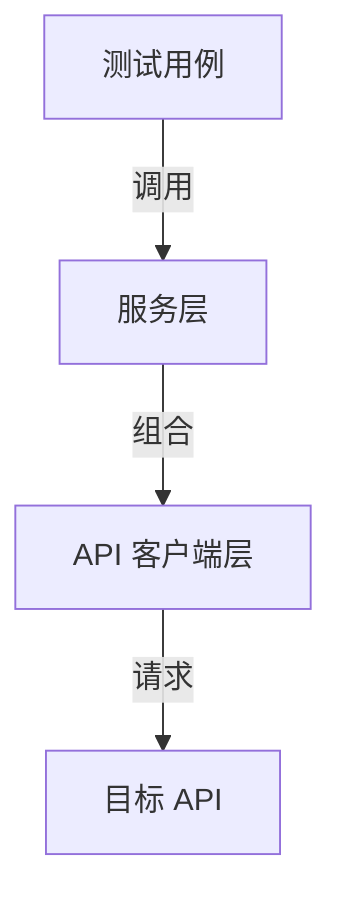

# Skill: 基于 Lounger 框架的分层 API 自动化测试设计

## 核心理念

**以测试为中心的设计**：摆脱脚本式的请求调用，采用面向对象的分层测试架构。

- **单接口**：使用语义化外观模式（Facade）隐藏原始 HTTP 细节。
- **多接口**：使用服务层编排业务流程，提升复用性。
- **目标**：提升可读性和可维护性，降低长期用例维护成本。

---

## 架构分层

采用经典三层结构分离职责：

| 层 | 名称 | 职责 | 关键词 |
|----|------|------|--------|
| **L1** | 测试用例层 | 描述"验证什么"，关注断言和业务数据 | pytest、assert、BDD |
| **L2** | 服务层 | 描述"流程如何运转"，将多个 API 组合为一个业务场景 | Flow、Orchestration、Reuse |
| **L3** | 客户端层 | 描述"如何调用 API"，用语义化方法封装单个端点 | HttpRequest、Facade、Semantic |



---

## 项目结构

```shell
project_root/
├── config/                        # 配置文件（环境变量、数据库等）
├── api/
│   ├── clients/                   # L3: API 客户端层
│   │   ├── __init__.py
│   │   └── {resource}_api.py      # 按资源命名，如 posts_api.py
│   └── services/                  # L2: 业务服务层（按需创建）
│       ├── __init__.py
│       └── {resource}_service.py  # 如 posts_service.py
├── test_dir/                      # L1: 测试用例层
│   ├── conftest.py                # fixture 定义
│   ├── {module}_case/             # 按模块分目录，如 posts_case/
│   │   ├── test_{action}_step0_binding.py   # 参数绑定验证
│   │   ├── test_{action}_step1_dto.py       # DTO 校验
│   │   ├── test_{action}_step2_service.py   # 服务层逻辑
│   │   └── test_{action}_step3_check.py     # 成功路径 + 数据库验证
│   └── test_data/                 # 测试数据文件（JSON）
├── reports/                       # 测试报告
├── conftest.py                    # 根级别 fixture（数据库连接、工具函数等）
├── pytest.ini
└── SKILL.md
```

> **注意**：以上为推荐结构，具体目录和文件请按实际业务模块命名。服务层（`services/`）不是必须的——如果项目以单接口测试为主，可以先跳过，后续有跨端点编排需求时再补充。

---

## L3: API 客户端层实现规范

### 基本原则

- 继承 `lounger.request.HttpRequest`
- 在 `__init__` 中初始化 `base_url` 和认证信息（如 `token`）
- 一个端点对应一个语义化方法名
- 使用 `@api` 装饰器标注方法（用于测试报告可读性）
- 请求参数使用 `dict` 类型，保持灵活性（支持正例和反例）
- 在方法内部定义请求 headers

### 代码示例

```python
from lounger.request import HttpRequest
from lounger.request import api


class PostsAPI(HttpRequest):
    """文章管理 API 客户端"""

    def __init__(self, base_url: str, token: str):
        super().__init__(base_url=base_url)
        self.token = token

    @api(describe="获取文章列表")
    def get_posts(self, params: dict = None):
        """
        GET /api/v1/posts - 获取文章列表
        """
        api_path = "/api/v1/posts"
        headers = {
            "Authorization": f"Bearer {self.token}",
            "Accept": "application/json",
        }
        return self.get(api_path, params=params or {}, headers=headers)

    @api(describe="创建文章")
    def create_post(self, data: dict):
        """
        POST /api/v1/posts - 创建文章
        """
        api_path = "/api/v1/posts"
        headers = {
            "Authorization": f"Bearer {self.token}",
            "Content-Type": "application/json",
        }
        return self.post(api_path, json=data, headers=headers)

    @api(describe="更新文章")
    def update_post(self, post_id: int, data: dict):
        """
        PUT /api/v1/posts/:id - 更新文章
        """
        api_path = f"/api/v1/posts/{post_id}"
        headers = {
            "Authorization": f"Bearer {self.token}",
            "Content-Type": "application/json",
        }
        return self.put(api_path, json=data, headers=headers)

    @api(describe="删除文章")
    def delete_post(self, post_id: int):
        """
        DELETE /api/v1/posts/:id - 删除文章
        """
        api_path = f"/api/v1/posts/{post_id}"
        headers = {
            "Authorization": f"Bearer {self.token}",
        }
        return self.delete(api_path, headers=headers)
```

### 关键约定

- 方法命名表达业务意图：`create_post` 而不是 `post_post`
- 不硬编码请求体，通过 `dict` 参数传入（方便构造正常和异常数据）
- 每个方法的 docstring 标注 `HTTP方法 URL - 说明`
- 认证方式在 `__init__` 中统一配置，单个方法如有特殊认证需求可覆盖

---

## L2: 业务服务层实现规范

### 基本原则

- 通过 `__init__` 注入依赖的 API 客户端实例
- 封装跨端点业务逻辑，让用例只需调用一个业务动作
- 在端点之间自动传递依赖数据

### 代码示例

```python
class PostService:
    """文章管理服务 - 编排多步骤操作"""

    def __init__(self, posts_api: PostsAPI, auth_api: AuthAPI):
        self.posts_api = posts_api
        self.auth_api = auth_api

    def create_post_as_admin(self, post_data: dict):
        """
        以管理员身份创建文章，自动处理认证和创建两步操作。

        执行步骤：
        1. 获取管理员 token
        2. 使用管理员 token 创建文章
        3. 返回创建结果
        """
        admin_token = self.auth_api.login_as_admin()
        return self.posts_api.create_post(post_data, token=admin_token)
```

### 适用场景

- 多端点流程（如：登录 → 创建资源 → 验证）
- 需要前置步骤才能执行验证的测试
- 可复用的复杂业务场景

> **注意**：如果项目以单接口测试为主，服务层不是必须的。只在出现重复的跨端点编排逻辑时再抽象。

---

## L1: 测试用例层实现规范

### 基本原则

- 通过 `conftest.py` 中的 fixture 注入依赖（API 客户端、数据库连接等）
- 使用 `pytest_req.assertions.expect` 统一断言
- 测试文件按模块分目录，按验证层级分文件
- 少量参数内联，5 个以上字段提取为变量或 JSON

### 测试文件组织与命名

按 API 操作的验证层级拆分文件，每个文件聚焦一类校验：

```
{module}_case/
├── test_{action}_step0_binding.py   # 参数类型/格式校验（400）
├── test_{action}_step1_dto.py       # 枚举值、取值范围校验
├── test_{action}_step2_service.py   # 业务逻辑校验（422 业务错误）
└── test_{action}_step3_check.py     # 成功路径 + 数据库一致性验证
```

**各层级职责：**

| Step | 验证层 | HTTP 状态码 | 典型场景 |
|------|--------|-------------|---------|
| 0 | Binding（参数绑定） | 400 | 类型错误、必填缺失 |
| 1 | DTO（数据传输对象） | 400/422 | 枚举值非法、格式不符合规范 |
| 2 | Service（业务逻辑） | 422 | 状态不满足操作条件、重复创建等 |
| 3 | Check（结果校验） | 200/201/204 | 成功操作 + 响应结构与数据库一致性 |

---

## Fixture 定义规范

Fixture 分两级管理：

- **根级 `conftest.py`**：数据库连接、全局工具函数等跨模块共享的资源。
- **`test_dir/conftest.py`**：API 客户端、Service 实例等测试专用的依赖注入。

### 环境配置 Fixture

```python
import pytest
from lounger.commons.load_config import base_url


@pytest.fixture(scope="session")
def env_config():
    """环境配置（会话级别，只初始化一次）"""
    return {
        "base_url": base_url,
        "token": "your-api-token"
    }
```

### API 客户端 Fixture

```python
from api.clients.posts_api import PostsAPI


@pytest.fixture()
def posts_api(env_config):
    """文章管理 API 客户端"""
    return PostsAPI(env_config["base_url"], env_config["token"])
```

**规范要点：**
- `env_config` 使用 `scope="session"`，整个测试会话只初始化一次
- API fixture 默认 `scope="function"`（每个用例独立实例，避免状态污染）
- 命名规则：`{模块名}_api`，对应 API 客户端类名的小写下划线形式
- 统一从 `env_config` 获取 `base_url` 和认证信息

### Service 层 Fixture

通过依赖注入组合多个 API 客户端：

```python
@pytest.fixture()
def post_service(posts_api, auth_api):
    """文章管理服务"""
    return PostService(posts_api, auth_api)
```

### 数据库 Fixture

数据库连接方式因项目环境而异，以下是两种常见模式：

**模式一：直连（开发/测试环境可直连数据库）**

```python
import pytest
from lounger.db_operation import MySQLDB
from lounger.utils.variables import ExtractVar

_extractor = ExtractVar()

@pytest.fixture(scope="session")
def mysql_db():
    """MySQL 直连"""
    with MySQLDB(
        host=_extractor.config("db_host"),
        port=int(_extractor.config("db_port")),
        user=_extractor.config("db_user"),
        password=_extractor.config("db_password"),
        database=_extractor.config("db_database"),
        charset=_extractor.config("db_charset"),
    ) as db:
        yield db
```

**模式二：SSH 隧道（远程数据库需要通过跳板机连接）**

```python
import pytest
from pathlib import Path
from lounger.db_operation import MySQLDB
from lounger.utils.variables import ExtractVar

_extractor = ExtractVar()


@pytest.fixture(scope="session")
def mysql_db():
    """MySQL 通过 SSH 隧道连接"""
    with MySQLDB.from_ssh_tunnel(
        ssh_host=_extractor.config("ssh_host"),
        ssh_port=int(_extractor.config("ssh_port")),
        ssh_user=_extractor.config("ssh_user"),
        ssh_private_key=str(Path(_extractor.config("ssh_private_key")).expanduser()),
        remote_db_host=_extractor.config("remote_db_host"),
        remote_db_port=int(_extractor.config("remote_db_port")),
        db_user=_extractor.config("db_user"),
        db_password=_extractor.config("db_password"),
        db_database=_extractor.config("db_database"),
        db_charset=_extractor.config("db_charset"),
        ssh_timeout=5,
    ) as db:
        yield db
```

> 根据项目实际网络环境选择一种即可。配置项通过 `config.yml` 或类似配置文件管理。

---

## 数据库操作

### MySQLDB 提供的方法

| 方法 | 说明 | 返回值 |
|------|------|--------|
| `mysql_db.query_sql(sql)` | 执行查询 SQL | `list[dict]` |
| `mysql_db.query_one(sql)` | 查询单行 | `dict` 或 `None` |
| `mysql_db.execute_sql(sql)` | 执行增删改 SQL | 受影响行数 |

### 在用例中直接使用

用于 API 调用后的数据一致性验证：

```python
def test_delete_post_success(posts_api, mysql_db):
    """删除成功 -> 204，并验证数据库记录"""
    post_id = 123

    # API 层验证
    s = posts_api.delete_post(post_id)
    expect(s).to_have_status_code(204)

    # 数据库层验证
    result = mysql_db.query_one(
        f"SELECT is_delete FROM posts WHERE id = {post_id}"
    )
    assert result["is_delete"] == 1
```

### TestHelper 模式

当一组测试需要反复操作数据库构造/复位数据时，将公共操作封装为辅助类：

```python
class TestHelper:
    """测试辅助类，封装数据库相关的公共操作"""

    __test__ = False  # 告诉 pytest 不要收集此类

    def __init__(self, mysql_db):
        self.db = mysql_db

    def reset_data(self):
        """复位数据到基线状态，确保每个用例从干净状态开始"""
        self.db.execute_sql("UPDATE orders SET status = 0 WHERE ...")
        print("✅ 数据已复位到基线")

    def insert_test_record(self, **kwargs):
        """插入一条测试记录"""
        # 构造 INSERT 语句...
        self.db.execute_sql(sql)
        print(f"✅ 已插入测试记录")
```

**在用例中使用：**

```python
from test_dir.module_case.common import TestHelper

def test_something(posts_api, mysql_db):
    h = TestHelper(mysql_db)
    h.reset_data()
    h.insert_test_record(name="test")
    # 执行业务操作 + 断言
```

### 数据库操作注意事项

1. **隔离性**：每个用例开始前将数据恢复到基线状态
2. **幂等性**：优先编写可重复执行的用例，不可重复的加 `@pytest.mark.skip`
3. **安全性**：UPDATE/DELETE 必须带限定条件，避免误操作全表
4. **可读性**：用 `print()` 输出操作日志，方便排查问题

---

## 断言规范

使用 `pytest_req.assertions.expect` 的链式断言：

### 常用断言方法

| 断言方法 | 说明 | 适用状态码 |
|----------|------|-----------|
| `to_have_status_code(code)` | 验证 HTTP 状态码 | 所有 |
| `to_have_path_value(path, value)` | 验证 JSON 路径的精确值 | 200/201/422 |
| `to_have_path_contains(path, substring)` | 验证 JSON 路径包含子串 | 400（错误信息通常只需部分匹配） |
| `to_be_ok()` | 验证响应成功（2xx） | 200/201/204 |

### 状态码与断言组合建议

```python
from pytest_req.assertions import expect

# 参数校验失败 → 400
expect(s).to_have_status_code(400)
expect(s).to_have_path_contains("message", "invalid syntax")

# 业务校验失败 → 422
expect(s).to_have_status_code(422)
expect(s).to_have_path_value("message", "resource already exists")

# 成功创建 → 200/201
expect(s).to_have_status_code(200)
expect(s).to_have_path_value("message", "created successfully")

# 成功查询 → 200
expect(s).to_have_status_code(200)
expect(s).to_have_path_value("data[0].name", "expected_name")

# 成功删除 → 204
expect(s).to_have_status_code(204)
```

---

## 参数化测试

使用 `lounger` 提供的 `@data` 装饰器：

```python
from lounger import data


# 字典列表：验证多种无效输入
@data([
    {"name": "", "msg": "name is required"},
    {"name": "ab", "msg": "name too short"},
    {"name": "a" * 256, "msg": "name too long"},
])
def test_create_post_invalid_name(posts_api, params):
    """参数化验证 name 字段的各种无效值"""
    s = posts_api.create_post({"name": params["name"]})
    expect(s).to_have_status_code(422)
    expect(s).to_have_path_value("message", params["msg"])


# 元组列表：验证多组正常输入
@data([
    ("en", "Hello"),
    ("zh", "你好"),
])
def test_create_post_multi_language(posts_api, params):
    """参数化验证多语言"""
    lang, expected = params
    s = posts_api.create_post({"lang": lang, "title": "test"})
    expect(s).to_have_status_code(200)
    expect(s).to_have_path_value("data.title", expected)
```

---

## Skip 规范

按原因分类，保持风格统一：

```python
# 不可重复执行（依赖特定数据，执行后数据状态改变）
@pytest.mark.skip("不可重复执行：该用例执行后会改变数据状态")

# 环境依赖（需要特定环境条件）
@pytest.mark.skip("环境限制：需要特定配置或长时间运行的任务")

# 数据依赖（需要预先在数据库中准备数据）
@pytest.mark.skip("需要数据库准备")

# 功能未实现
@pytest.mark.skip("待确认：对应功能尚未实现")
```

---

## 测试用例文档规范

每个用例的 docstring 建议包含以下要素：

```python
def test_create_post_empty_name(posts_api):
    """Step 1: name 为空字符串应返回 422

    验证位置：post_handler.go:L50 ValidateCreatePostRequest
    触发条件：name 字段传入空字符串
    预期返回：422，message 包含 "name is required"
    """
```

---

## 决策矩阵

| 场景 | 推荐方式 | 原因 |
|------|----------|------|
| 单端点功能测试 | 直接调用 API 客户端 | 简单直接 |
| 多端点业务流程 | 使用服务层 | 避免重复编排逻辑 |
| 临时调试或探索 | 使用原始请求 | 快速验证 |
| 第三方 API 集成 | 用 client + service 封装 | 隔离外部变化 |
| 入参 < 5 个字段 | 参数内联在用例中 | 一目了然 |
| 入参 >= 5 个字段 | 提取为变量或用 JSON 文件 | 数据与代码分离 |
| 数据库操作仅一个用例使用 | 直接在用例中调用 `mysql_db` | 简单 |
| 数据库操作被多个用例复用 | 封装到 `TestHelper` 类 | 避免重复 SQL |

---

## 常见反模式（避免）

**不要：**
- 在 `test_*.py` 中直接写 `get()` / `post()` 裸调用
- 在服务层硬编码端点 URL
- 过度设计一次性流程（没有复用价值的不建 Service）
- 在每个测试文件中重复定义相同的 fixture

**最佳实践：**
- 优先新增文件和方法，避免改写已有代码
- 使用 `dict` 传参以灵活支持正常和异常测试
- 从统一的 `conftest.py` 复用共享 fixture
- 测试数据和测试逻辑分离

---

## 关键收益

### 可读性

- `posts_api.create_post(data)` 比 `post("/api/v1/posts", ...)` 更清晰
- 语义化方法名让测试用例成为可读的文档

### 可维护性

- 端点变更只需修改客户端层
- 流程变更只需修改服务层
- 测试文件可以保持不变

### 可复用性

- 业务流程可在正常、异常和性能场景中复用
- 共享 fixture 减少重复的初始化逻辑

### 工程质量

- 遵循 SRP（单一职责）和 OCP（开闭原则）
- 适合中大型自动化项目扩展
- 与 CI 流水线良好配合

---

**版本**: v1.0
**更新日期**: 2026-06-03
