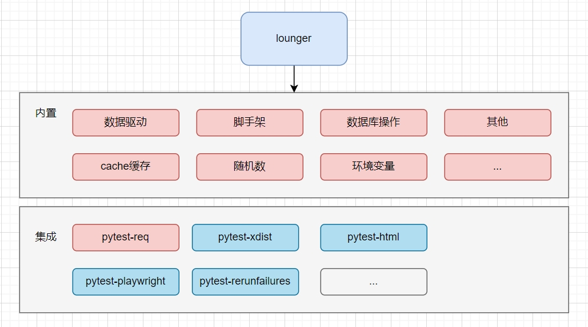

# lounger

Next generation automated testing framework.

## feature

🌟 支持`web`/`api`测试。

🌟 提供脚手架生成自动化项目。

🌟 更好用的数据驱动。

🌟 支持数据库操作。

🌟 已经配置好的测试报告（包含截图、日志）。

## framework

lounger不是一个从零开始的自动化测试框架，建立在`pytest`生态的基础上，提供更加简单的使用体验。



## Install

* pip安装。

```shell
$ pip install lounger
```

* 体验最新的项目代码。

```shell
$ pip install -U git+https://github.com/SeldomQA/lounger.git@main
```

此外，如果做Web自动化测试，请单独安装测试浏览器。

```shell
$ playwright install chromium[可选]
$ playwright install firefox[可选]
$ playwright install webkit[可选]
...
```

## scaffold

lounger提供了脚手架，直接创建项目和使用。

```shell
$ lounger --help

Usage: lounger [OPTIONS]

  lounger CLI.

Options:
  --version                Show version.
  -pw, --project-web TEXT  Create an web automation test project.
  -pa, --project-api TEXT  Create an api automation test project.
  --help                   Show this message and exit.
```

* 创建web自动化测试项目。

```shell
$ lounger -pw myweb

2024-08-17 22:05:04 | INFO     | cli.py | Start to create new test project: myweb
2024-08-17 22:05:04 | INFO     | cli.py | CWD: D:\github\seldomQA\lounger
2024-08-17 22:05:04 | INFO     | cli.py | created folder: myweb
2024-08-17 22:05:04 | INFO     | cli.py | created folder: myweb\reports
2024-08-17 22:05:04 | INFO     | cli.py | created file: myweb\test_web.py
2024-08-17 22:05:04 | INFO     | cli.py | created file: myweb\pytest.ini
```

* 创建api自动化测试项目。

```shell
$ lounger -pa myapi

2024-08-17 22:05:31 | INFO     | cli.py | Start to create new test project: myapi
2024-08-17 22:05:31 | INFO     | cli.py | CWD: D:\github\seldomQA\lounger

2024-08-17 22:05:31 | INFO     | cli.py | created folder: myapi
2024-08-17 22:05:31 | INFO     | cli.py | created folder: myapi\reports
2024-08-17 22:05:31 | INFO     | cli.py | created file: myapi\test_api.py
2024-08-17 22:05:31 | INFO     | cli.py | created file: myapi\pytest.ini
```

* 直接运行测试

```shell
$ cd myweb  # or myapi
$ pytest
```

## 示例

[tests](./tests/) 提供了大量的示例学习。你会看到不少 seldom 类似的用法。
